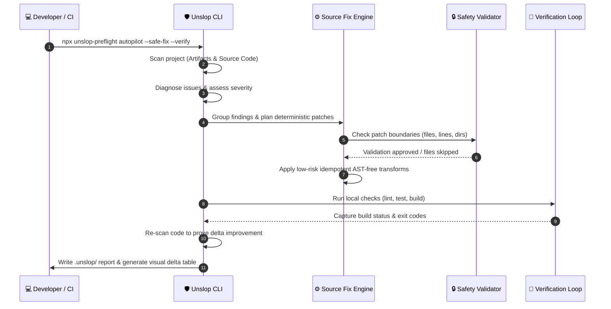

<div align="center">

# ✨ UNSLOP PREFLIGHT ✨

The package name is `unslop-preflight`.

<p align="center">
  <strong>The Ultimate Preflight & Autonomous Repair Guardrails for AI-Built Frontends.</strong>
  <br />
  <em>Stop AI coding agents before they ship fragile, slop-ridden frontend layouts.</em>
</p>

---

### 🛡️ Core Package Metrics & Ecosystem

[](https://www.npmjs.com/package/unslop-preflight)
[](https://www.npmjs.com/package/unslop-preflight)
[](https://github.com/imMamdouhaboammar/unslop-preflight/actions/workflows/ci.yml)
[](./LICENSE)

[](https://socket.dev/npm/package/unslop-preflight)
[](https://socket.dev/npm/package/unslop-preflight)
[](https://socket.dev/npm/package/unslop-preflight)
[](https://socket.dev/npm/package/unslop-preflight)
[](https://socket.dev/npm/package/unslop-preflight)

[](https://skills.sh/imMamdouhaboammar/unslop-preflight)
[](./SKILL.md)
[](./CHANGELOG.md)

<br />

```bash
npx unslop-preflight autopilot --safe-fix --verify
```

**One command runs 23+ readiness gates, scans frontend source code for AI-generated visual slop, plans deterministic repairs, applies low-risk safe patches, runs full lockfile-aware verification checks, and creates interactive human/agent reports.**

[Quick Start](#-quick-start) · [Autopilot Repair Loop](#-autopilot-repair-loop) · [Cleanup Prompt](#-copypaste-cleanup-prompt-for-vibe-coders) · [Slop Detectors](#-source-slop-detectors) · [Readiness Bands](#-readiness-bands) · [CLI Reference](#-cli-command-suite) · [Base Gates](#-the-23-base-gates) · [Docs Map](#-documentation--resource-map)

---

</div>

## 💡 Why Unslop Exists

AI coding agents (like Claude Code, Cursor, Windsurf, and Copilot) have made frontend building **10x faster**.  
Unfortunately, they have also made fragile, sloppy frontend decisions **10x easier to repeat and ship**.

When agents "vibe code" without strict guardrails, subtle but dangerous UI regressions accumulate:
*   **The Clickable `<div>`**: Interactive elements written without keyboard support, screen-reader landmarks, or ARIA labels.
*   **The Blind `z-9999` Fix**: Stacking-context bugs "patched" by slapping extreme z-index values on arbitrary elements.
*   **The Desktop-Only Modal**: Overlays that look beautiful on a 27-inch display but clip content or lock scrolling on mobile screens.
*   **The Transition-All Slowdown**: Broad `transition-all` declarations on massive DOM elements, tanking interaction fidelity (INP).
*   **The Sample Data Leak**: Generic placeholders, mock usernames, and dummy domains shipping directly into production bundles.

**Unslop acts as a rigorous quality gate and auto-repair preflight layer.** It checks product specifications, design systems, agent instructions, and raw source code *before* deployment or handoff, giving your AI agent crystal-clear boundaries and deterministic fixes.

---

## 💡 Benchmark Status & Limitations

> [!WARNING]  
> **Torture Bench Status: ❌ FAIL (Current Score: 3.00 / 5.0)**
>
> The latest execution of the internal **Unslop Torture Bench** resulted in an average score of **3.00 / 5.0**, which is below our strict quality threshold of **4.0**.
> This failure highlights key gaps in dynamic overlay edge-case detection and complex responsive layout scanning. Active hardening is underway, but users should maintain realistic expectations.

Unslop is a **static preflight guardrail**, not a visual layout engine or runtime simulator. It does *not* replace:
*   **Runtime E2E Testing**: Static source scanning catches structural patterns, but does not execute app logic.
*   **Manual Accessibility Audits**: While static detectors flag bad semantics, only human keyboard and screen-reader test runs guarantee compliance.
*   **Visual QA & Browser Compatibility**: Unslop does not render the DOM; cross-browser paint bugs must be checked manually or via screenshot-testing rigs.

---

## 🔄 Autopilot Repair Loop

Unslop Autopilot implements a robust, doctor-style source-repair loop:  
`Scan → Diagnose → Plan Safe Patches → Apply Patches → Run Project Checks → Re-scan → Prove Improvement`



---

## 🚀 Quick Start

### Run the full loop instantly with zero installation:
```bash
npx unslop-preflight autopilot
```

### Install in your project for continuous checks:
```bash
npm install --save-dev unslop-preflight
```

### Initialize documentation structures only:
```bash
npx unslop-preflight init
npx unslop-preflight audit
npx unslop-preflight repair --dry-run --report
```

### Direct source-code scanning:
```bash
npx unslop-preflight scan src --strict
```

### Skip source-code scanning (for spec-only audits):
```bash
npx unslop-preflight autopilot --no-source-scan
```

### Install as an global agent skill:
```bash
npx skills add imMamdouhaboammar/unslop-preflight
```

---

## 📝 Copy/Paste Cleanup Prompt for Vibe Coders

If you are a builder delegating development to AI coding agents (like Claude Code, Cursor, Codex, Antigravity, OpenCode, Windsurf, or similar), **you don't need to run these commands yourself**.

Copy the prompt block below, paste it directly into your agent's chat, and let it handle the audit, safe source repairs, and remaining fix logs for you:

> [!TIP]  
> **Copy the prompt below to hand over the entire Unslop execution and repair process to your AI agent.**

```txt
You are my cleanup agent.

I want you to inspect this project, install and run Unslop Preflight, then fix the issues it reports.

Follow these steps carefully:

1. First, inspect the project structure.
   Look for package.json, README, src/, app/, components/, pages/, styles, and any existing tests.

2. Check which package manager this project uses.
   If there is pnpm-lock.yaml, use pnpm.
   If there is package-lock.json, use npm.
   If there is yarn.lock, use yarn.
   Do not switch package managers.

3. Run Unslop Preflight with the correct direct command:

   npx unslop-preflight autopilot --safe-fix --verify --report --strict

   (Fallback: If the project is important or unstable, run first in plan-only mode:
    npx unslop-preflight autopilot --plan-only --report)

4. After it runs, open and read:
   - .unslop/report.md
   - .unslop/report.json
   - .unslop/fix-list.md
   - .unslop/source-fixes.md (if present)

5. Fix the project based on the fix list.
   Important:
   - Apply safe documentation/spec fixes first.
   - Fix source code issues carefully.
   - Do not rewrite the whole app.
   - Do not delete files unless clearly necessary.
   - Do not change product behavior unless the report clearly requires it.
   - Do not touch secrets, .env files, tokens, or credentials.
   - Do not install new dependencies unless you explain why they are needed.

6. Focus especially on:
   - generic AI-looking UI (gradient, glass, floating element slop)
   - broken responsive behavior (fixed widths, vh risks)
   - modal and overlay issues (z-index hacks, scroll leaks)
   - missing loading, empty, and error states
   - accessibility problems (clickable divs, missing alt/labels)
   - weak focus states (outline-none)
   - unsafe target="_blank" links
   - hardcoded sample data leaking into code
   - messy component structure
   - unclear PRODUCT.md, DESIGN.md, or AGENTS.md handoff

7. After fixing, run Unslop again:

   npx unslop-preflight autopilot --safe-fix --verify --report --strict

8. Repeat until:
   - the report has no critical blockers
   - the fix-list is small and clear
   - the app still builds
   - the changes are easy to review

9. Run the project’s normal checks.
   Use the scripts available in package.json, such as:
   - npm run build
   - npm run test
   - npm run lint
   - npm run typecheck
   (Use the project’s actual package manager)

10. At the end, give me a clear summary:
    - What Unslop found
    - What you fixed
    - What files you changed
    - What commands you ran
    - What checks passed
    - What still needs human review

Do not claim everything is fixed unless the report and checks prove it.
```

---

## 🛠️ Repair Modes & Configuration

Autopilot supports **4 distinct modes** tailored to different levels of risk tolerance:

| Mode | Flag | Description | Default Status |
| :--- | :--- | :--- | :--- |
| **Plan Only** | `--plan-only` | Runs full static audits and source scans. Emits reports but makes **no** file modifications. | Safe |
| **Doc Fix Only** | `--doc-fix` | Safe, non-destructive repair of `PRODUCT.md`, `DESIGN.md`, and `AGENTS.md`. No source code touch. | **Default** |
| **Safe Source Fix** | `--safe-fix` | Applies doc fixes AND deterministic, idempotent source patches under strict safety guardrails. | Active Opt-In |
| **Agent Fix Guide** | `--agent-fix` | Generates a targeted, context-rich engineering prompt in `.unslop/agent-fix-prompt.md`. | Advanced Handoff |

### 🔒 Safety Validator Boundaries (For `--safe-fix` mode)
To prevent rogue edits or broken files, our safety validator enforces:
*   **Directory Confinement**: Files must lie strictly within the project root directory.
*   **Excluded Directories & Files**: Never touches `node_modules`, `.env`, lockfiles, `dist`, `build`, or `.unslop` caches.
*   **Safe Extension Whitelist**: Only operates on `.js`, `.jsx`, `.ts`, `.tsx`, `.css`, and `.md` files.
*   **Strict Size Budgets**:
    *   Maximum modified files per run: **20** (configurable with `--max-fix-files`)
    *   Maximum modified lines per file: **50**
    *   Maximum total changed lines per run: **300** (configurable with `--max-fix-lines`)

---

## 🔍 Source Slop Detectors

Unslop scans source trees using **14 high-precision, low-noise static detectors** calibrated for AI-generated patterns:

| Detector ID | Focus Area | Danger Flagged | Safe Auto-Fix Action (with `--safe-fix`) |
| :--- | :--- | :--- | :--- |
| `unstable-random-key` | React State | Dynamic keys (`Math.random()`) causing components to unmount & lose state. | *Planned for Agent Handoff* |
| `array-index-key-reorder-risk` | Performance | Using index as keys, causing list re-rendering glitches on sort/filter. | *Planned for Agent Handoff* |
| `outline-none-without-focus-visible` | Accessibility | Hiding focus outlines (`outline-none`), breaking keyboard accessibility. | Appends matching `:focus-visible:outline-none focus-visible:ring-2` to restore access. |
| `icon-only-button-review` | Accessibility | Buttons containing only SVG/icons with no text, hidden from screen readers. | *Manual Fix List* |
| `image-without-size-review` | Layout / LCP | Image elements missing explicit width/height causing visual layout shifts. | *Manual Fix List* |
| `target-blank-without-rel` | Security | `target="_blank"` links missing `rel="noopener noreferrer"` (tab-nabbing risk). | Automatically appends `rel="noopener noreferrer"`. |
| `input-without-autocomplete-review` | User Experience | Form fields (email, password, search) missing native autocomplete flags. | *Manual Fix List* |
| `motion-without-reduced-motion-review` | Accessibility | CSS animations and transitions lacking `@media (prefers-reduced-motion: reduce)`. | *Manual Fix List* |
| `collection-map-empty-state-review` | UX Completeness | Mapping over an array in React without a fallback conditional empty state view. | *Manual Fix List* |
| `async-view-state-review` | UX Completeness | Fetching or rendering asynchronous data without loading and error views. | *Manual Fix List* |
| `hardcoded-color-token-drift` | Maintainability | Random hex/rgb values hardcoded outside central theme or tokens configurations. | *Manual Fix List* |
| `generic-ai-aesthetic-stack` | Visual Taste | Generic gradients, floating overlays, heavy glassmorphism without clean structure. | *Manual Fix List* |
| `transition-all-animation-slop` | Interaction (INP) | Heavy `transition-all` on elements containing complex children. | Maps to discrete transition rules (e.g. `transition-colors`, `transition-transform`). |
| `sample-data-shipping-risk` | Data Privacy | Sample mock names ("John Doe", "example.com") leaking into production. | *Manual Fix List* |

---

## 🚦 Readiness Bands

Unslop computes a consolidated **Project Readiness Score** and assigns one of 4 readiness bands to determine if your code is prepared for an AI-agent implementation pass:

```text
 🔴 BLOCKED               → Critical spec gaps or source blockers exist. Stop work immediately.
 🟡 NEEDS-SPEC-WORK       → Strategic documents exist but are too sparse. Repair specs first.
 🟢 READY-WITH-FIX-LIST   → Ready to move forward once the attached .unslop/fix-list.md is addressed.
 🔵 AGENT-READY           → Excellent context, design contracts, and safety markers. Proceed with confidence.
```

The readiness score aggregates 23 core categories across product definition, design contracts, accessibility parameters, stacking governance, and source code health.

---

## 💻 CLI Command Suite

```bash
npx unslop-preflight <command> [options]
```

### Unified Command Matrix

| Command | Description | Practical Usage |
| :--- | :--- | :--- |
| **`autopilot`** | Runs full preflight, repair, source scan, verification, and writes reports. | `npx unslop-preflight autopilot --safe-fix --verify` |
| **`init`** | Bootstraps standard templates for `PRODUCT.md`, `DESIGN.md`, and `AGENTS.md`. | `npx unslop-preflight init` |
| **`audit`** | Evaluates static artifacts against readiness rules and prints category breakdowns. | `npx unslop-preflight audit --verbose` |
| **`scan`** | Runs static slop detectors against source code directories. | `npx unslop-preflight scan src --strict` |
| **`standards`** | Inspects or lists available modular standards pack profiles. | `npx unslop-preflight standards inspect vibe-coding` |
| **`repair`** | Executes non-destructive repair logic for specifications and markdown documents. | `npx unslop-preflight repair --dry-run --report` |
| **`report`** | Processes findings database and emits `.unslop/` documentation files. | `npx unslop-preflight report` |
| **`doctor`** | Checks local developer environment, node version, and lockfile configuration. | `npx unslop-preflight doctor` |
| **`update`** | Synchronizes and updates the local CLI runner to the latest registry version. | `npx unslop-preflight update` |

### Key Flags & Options
*   `--verify`: Automatically detects lockfile (`npm`, `pnpm`, `yarn`, `bun`), runs available checks (`test`, `build`, `lint`, `typecheck`), and records delta results.
*   `--verify-timeout=120`: Absolute synchronous verification runner timeout (default: 120s).
*   `--max-passes=N`: Maximum recursive correction passes (1-10) autopilot is permitted to run.
*   `--strict`: Treats warnings and static scanner failures as hard blocking errors.
*   `--standards=vibe-coding`: Activates a strict modular standards profile (Vibe Coding profile enforces advanced type safety and architecture gates).

---

## 🧬 The 23 Base Gates

<details>
<summary>🔍 Click to view the full directory of Unslop Base Quality Gates</summary>

| ID | Gate Name | Technical Mandate / Rule Checked |
| :--- | :--- | :--- |
| **1** | Design System Baseline | Restrict random asset imports; declare central baseline (e.g. Tailwind, Radix). |
| **2** | Intake Session | Ensure audience definitions, core user actions, localization, and technical risks exist. |
| **3** | Standards Search | Require search references or specifications (WCAG, MDN, framework guidelines). |
| **4** | Unslop Install | Log setup runs and verify tool hooks exist before drafting layouts. |
| **5** | PRODUCT.md Spec | Verify strategic product artifact exists, passes validation, and contains no defaults. |
| **6** | DESIGN.md Contract | Check that typography tokens, layout grids, components, and responsive specs are configured. |
| **7** | Rules Engine | Assure that all artifact evaluation metrics run consistently. |
| **8** | Accessibility & RTL | Check focus indicators, color contrast baselines, LTR defaults, and explicit RTL support. |
| **9** | UX-CRX Logic | Primary actions, secondary actions, error states, and clear escape paths for every view. |
| **10** | Mobile & Responsive | Mobile-first layouts must be explicitly planned; no lazy desktop stacking. |
| **11** | Popup & Feedback | Prohibit raw, blocking native `alert()` or `confirm()` methods in visual product paths. |
| **12** | Implementation Scan | Scan source trees and block code compilation if fatal markers exist before merge. |
| **13** | Amplify Preservation | Track existing high-value user decisions to prevent overwrite cycles. |
| **14** | Semantic HTML | Forbid interactive `<div>` blocks; enforce native elements and landmarks. |
| **15** | Realistic Content | Ban dummy content ("Lorem Ipsum", "test@test.com", fake customer models). |
| **16** | Design Tokens | Block hardcoded color values; enforce strict CSS custom properties or theme configuration. |
| **17** | Drift Control | Define single-source-of-truth rules and run gates on every branch merge. |
| **18** | Viewport Governance | Enforce scrolling ownership, dynamic height (`dvh`) strategies, and zero root overflows. |
| **19** | Modal & Dialog | Modals must handle focus trapping, scroll locks, and safe overlay viewport bounds. |
| **20** | Dashboard Shell | Grid coordinates, centralized auth state shell, responsive sidebars, and form fields. |
| **21** | Overlay Stack | Centralized overlay mounting, toast duration constraints, and toast collisions handling. |
| **22** | Sensitive Data UX | Secure input masking, multi-factor triggers, and explicit double-step deletion gates. |
| **23** | Popover Positioning | Floating panels must implement flip/shift layout safety and declare standard z-index indexes. |

</details>

---

## 📦 Modular Standards Profiles

Unslop supports an optional, opt-in **Modular Standards Pack System** to enforce rigorous, domain-specific coding standards. 

The first integrated pack is the **Vibe Coding Standards Pack** (`vibe-coding`), enforcing:
*   Strict TypeScript type safety (no loose `any` casts).
*   Unified dependency structure (no duplicate libraries or bulk packages).
*   Isolated component modularity (preventing monolithic multi-hundred line visual scripts).
*   Centralized application storage hooks.
*   Exposed secret and token auditing.

### Commands to Run Profiles:
```bash
# List available profiles
npx unslop-preflight standards list

# Inspect a specific standards pack
npx unslop-preflight standards inspect vibe-coding

# Execute autopilot enforcing the profile
npx unslop-preflight autopilot --standards=vibe-coding
```

---

## 📁 Documentation & Resource Map

Explore our detailed resource manuals to deep dive into the inner workings of Unslop:

| Target Resource | Purpose & Contents |
| :--- | :--- |
| [**`SKILL.md`**](./SKILL.md) | Universal behavioral definitions and runtime guidelines for AI integrations. |
| [**`AGENTS.md`**](./AGENTS.md) | Repository-scoped rule specifications, task priorities, and coding constraints. |
| [**`docs/SOURCE_SLOP_DETECTORS.md`**](./docs/SOURCE_SLOP_DETECTORS.md) | Architectural details on code patterns, AST representations, and heuristic rules. |
| [**`docs/STANDARDS_PACKS.md`**](./docs/STANDARDS_PACKS.md) | Guide to extending and writing your custom Modular Standards profiles. |
| [**`docs/VIBE_CODING_STANDARDS_PACK.md`**](./docs/VIBE_CODING_STANDARDS_PACK.md) | Remediations, details, and guidelines for the unified Vibe-Coding profile. |
| [**`docs/ROOT_CAUSE_MODE.md`**](./docs/ROOT_CAUSE_MODE.md) | Deep analysis of the "Diagnosis-First" resolution process for bugs and layout errors. |
| [**`docs/OVERLAY_LAYERING_GATES.md`**](./docs/OVERLAY_LAYERING_GATES.md) | Detailed rules for stacking systems, z-index indexes, and modal viewport limits. |
| [**`docs/INSTALL_AGENT_HARNESS.md`**](./docs/INSTALL_AGENT_HARNESS.md) | Guidelines for selecting and deploying micro-tool harnesses on AI runtimes. |
| [**`docs/AI_AGENT_READINESS.md`**](./docs/AI_AGENT_READINESS.md) | Complete explanation of score aggregation, categories, and readiness band criteria. |
| [**`docs/NPM_PUBLISHING.md`**](./docs/NPM_PUBLISHING.md) | Secure publishing manuals using OpenID Connect (OIDC) and GitHub Trusted Publishers. |
| [**`references/`**](./references/) | Directory of rule references, raw criteria sheets, and category criteria. |

---

## 🗺️ Repository Map

```text
unslop-preflight/
├── .github/workflows/          # CI/CD and automated secure OIDC npm publishing
├── bin/                        # CLI command-line entry scripts
├── src/
│   ├── commands/               # CLI handlers: autopilot, init, scan, audit, standards, repair
│   ├── core/                   # Engines: sourceFixEngine, safetyValidator, verify, report, scannerUtils
│   ├── rules/                  # Gate definitions: product, design, UX, accessibility, overlays, z-index
│   └── scanners/               # Code analyzers: sourceSlop, layering, responsive, typography scanners
├── scripts/                    # Supporting validators, evaluations, and viewport-fit scripts
├── assets/                     # Generation templates for docs, reports, and prompts
├── references/                 # Base JSON criteria matrices and standards pack criteria
├── docs/                       # Comprehensive documentation books and manuals
├── tests/                      # Extensive test runner coverage suite (73+ tests)
├── AGENTS.md                   # Agent instructions for development on this repository
├── SKILL.md                    # Skill behavior contract for agent execution engines
└── package.json                # Project description and dependency manifest
```

---

<div align="center">

**Crafted with care to bring rigorous architectural discipline and gorgeous visual elegance to AI-driven frontend workflows.**

[GitHub](https://github.com/imMamdouhaboammar/unslop-preflight) · [npm](https://www.npmjs.com/package/unslop-preflight) · [skills.sh](https://skills.sh/imMamdouhaboammar/unslop-preflight) · [Issues](https://github.com/imMamdouhaboammar/unslop-preflight/issues)

</div>
