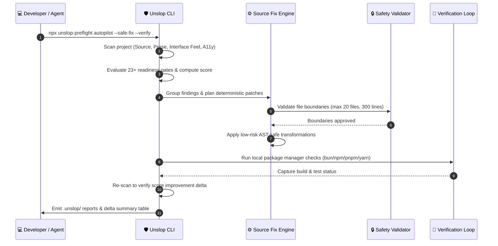

<div align="center">

# ✨ UNSLOP PREFLIGHT ✨

The package name is `unslop-preflight`.

<p align="center">
  
</p>

### 🛡️ The Ultimate Preflight & Autonomous Repair Guardrails for AI-Built Frontends

*Stop AI coding agents before they ship fragile, slop-ridden frontend layouts into production.*

---

[](https://www.npmjs.com/package/unslop-preflight)
[](https://www.npmjs.com/package/unslop-preflight)
[](https://github.com/imMamdouhaboammar/unslop-preflight/actions/workflows/ci.yml)
[](./LICENSE)

[](https://socket.dev/npm/package/unslop-preflight)
[](https://socket.dev/npm/package/unslop-preflight)
[](https://socket.dev/npm/package/unslop-preflight)
[](https://skills.sh/imMamdouhaboammar/unslop-preflight)
[](./CHANGELOG.md)

<br />

```bash
npx unslop-preflight autopilot --safe-fix --verify
```

---

### 📊 GitHub Repository & Developer Stats

<p align="center">
  
</p>

<p align="center">
  
  
</p>

---

</div>

## 💡 Why Unslop Preflight Exists

AI coding agents (like Claude Code, Cursor, Windsurf, Copilot, and Gemini CLI) make frontend development **10x faster**, but they also repeat fragile, sloppy frontend decisions **10x faster**.

When agents "vibe code" without strict guardrails, subtle but dangerous UI regressions accumulate:
- ❌ **The Clickable `<div>`**: Interactive elements written without keyboard support or ARIA landmarks.
- ❌ **The Blind `z-9999` Fix**: Stacking-context bugs "patched" by slapping extreme z-indexes on arbitrary elements.
- ❌ **The Desktop-Only Modal**: Overlays that clip content or lock scrolling on mobile screens.
- ❌ **The Transition-All Slowdown**: Broad `transition: all` declarations that tank Interaction to Next Paint (INP).
- ❌ **The Banned AI Slop Copy**: Words like *delve, foster, leverage, utilize, robust* and throat-clearing setups that sound like generic AI output.

**Unslop Preflight acts as a rigorous quality gate and auto-repair preflight layer.** It integrates **7 premier open-source engines** natively into a single CLI tool to guarantee pixel-perfect, accessible, slop-free frontend deliveries.

---

## ⚡ 7 Integrated Native Engines

| Engine / Repository | Native Role in Unslop | Integrated Subcommand & Core Module |
| :--- | :--- | :--- |
| **`no-ai-slop`** (`petergyang/no-ai-slop`) | Copy & prose slop scanner & refactoring engine | `unslop scan --prose` / `src/scanners/proseScanner.js` |
| **`loop-engineering`** (`cobusgreyling/loop-engineering`) | L1/L2 continuous engineering loop engine | `unslop loop` / `src/core/loopGate.js` / `STATE.md` |
| **`ui-review-loop`** (`amElnagdy/ui-review-loop`) | Visual browser UI testing & recording loop | `unslop review` / `src/core/reviewRecorder.js` |
| **`browser-use`** (`browser-use/browser-use`) | Headless browser automation & viewport testing | `src/scanners/browserAutomation.js` |
| **`make-interfaces-feel-better`** (`jakubkrehel/make-interfaces-feel-better`) | 19 design engineering polish principles | `unslop scan --feel` / `src/scanners/interfaceFeelScanner.js` |
| **`ui-skills`** (`ibelick/ui-skills`) | Baseline UI quality & motion performance rules | `src/rules/motionRules.js` |
| **`ux-ui-agent-skills`** (`plugin87/ux-ui-agent-skills`) | Design tokens & multi-agent taste calibration | `SKILL.md` / `AGENTS.md` / `src/rules/tasteCalibration.js` |

---

## 🔄 Autopilot Repair Architecture


```mermaid
sequenceDiagram
    autonumber
    participant Dev as 💻 Developer / Agent
    participant CLI as 🛡️ Unslop CLI
    participant Engine as ⚙️ Source Fix Engine
    participant Safety as 🔒 Safety Validator
    participant Verifier as 🧪 Verification Loop

    Dev->>CLI: npx unslop-preflight autopilot --safe-fix --verify
    CLI->>CLI: Scan project (Source, Prose, Interface Feel, A11y)
    CLI->>CLI: Evaluate 23+ readiness gates & compute score
    CLI->>Engine: Group findings & plan deterministic patches
    Engine->>Safety: Validate file boundaries (max 20 files, 300 lines)
    Safety-->>Engine: Boundaries approved
    Engine->>Engine: Apply low-risk AST-safe transformations
    CLI->>Verifier: Run local package manager checks (bun/npm/pnpm/yarn)
    Verifier-->>CLI: Capture build & test status
    CLI->>CLI: Re-scan to verify score improvement delta
    CLI->>Dev: Emit .unslop/ reports & delta summary table
```

---

## 🚀 Quick Start

### Run instant preflight scan & auto-repair:
```bash
npx unslop-preflight autopilot --safe-fix --verify
```

### Install in your project:
```bash
# Using Bun (Recommended)
bun add -d unslop-preflight

# Using npm / pnpm / yarn
npm install --save-dev unslop-preflight
```

### Initialize handoff artifacts:
```bash
npx unslop-preflight init
```

### Run specialized scans:
```bash
# Source code slop scan
npx unslop-preflight scan src --strict

# Prose & copy slop scan
npx unslop-preflight scan --prose

# Interface polish & feel scan
npx unslop-preflight scan --feel
```

---

## 💻 CLI Command Suite

| Command | Description | Example Usage |
| :--- | :--- | :--- |
| **`autopilot`** | Full preflight, repair, source scan, verification, and report generation. | `npx unslop-preflight autopilot --safe-fix --verify` |
| **`scan`** | Scans source code, copy, interface feel, accessibility, and viewport layout. | `npx unslop-preflight scan src --strict` |
| **`loop`** | Continuous loop engineering runner (daily-triage, PR babysitter, CI sweeper). | `npx unslop-preflight loop status` |
| **`review`** | Browser UI review recorder (video, DOM timeline, network HAR, coverage audit). | `npx unslop-preflight review start --url http://localhost:3000` |
| **`init`** | Bootstraps `PRODUCT.md`, `DESIGN.md`, and `AGENTS.md` artifacts. | `npx unslop-preflight init` |
| **`audit`** | Evaluates static artifacts against readiness gates. | `npx unslop-preflight audit` |
| **`standards`** | Inspects or lists available modular standards pack profiles. | `npx unslop-preflight standards inspect vibe-coding` |
| **`repair`** | Executes non-destructive repair logic for markdown & source files. | `npx unslop-preflight repair --safe-fix` |
| **`doctor`** | Checks environment health, Node/Bun version, and lockfile configuration. | `npx unslop-preflight doctor` |

---

## 🔒 Security Best Practices & Supply Chain Defense

Following `npm-security-best-practices` guidelines:
- **Lockfile Integrity**: Lockfiles (`package-lock.json`, `bun.lock`, `pnpm-lock.yaml`) are strictly verified during preflight.
- **Trusted OIDC Publishing**: NPM releases are signed using GitHub Actions OIDC Trusted Publishing with provenance attestations (`--provenance`).
- **Secret & Token Hygiene**: Embedded credential detector scans and blocks hardcoded API keys, JWTs, and private tokens.
- **Zero-Script Overhead**: Unslop runs cleanly with `ignore-scripts` compatibility and zero postinstall security vulnerabilities.

---

## 📋 Copy/Paste Prompt for AI Coding Agents

> [!TIP]
> **Copy this prompt into Claude Code, Cursor, Gemini CLI, Windsurf, or Copilot to delegate the entire preflight and cleanup loop:**

```txt
You are my cleanup agent.

Please inspect this project, install and run Unslop Preflight, then fix the reported issues:

1. Detect the active package manager (Bun, npm, pnpm, or yarn).
2. Run:
   npx unslop-preflight autopilot --safe-fix --verify --report --strict
3. Read the generated reports in .unslop/ (report.md, fix-list.md, source-fixes.md).
4. Address remaining findings in source code:
   - Fix prose slop, banned AI words, and throat-clearing copy.
   - Fix interface feel issues (concentric border radius, scale on press, transition: all).
   - Fix accessibility errors (clickable divs, icon-only buttons, missing focus-visible).
   - Fix modal viewport clipping and z-index stacking bugs.
5. Re-run:
   npx unslop-preflight autopilot --safe-fix --verify --report --strict
6. Verify that all project checks (build, test, lint, typecheck) pass cleanly.
```

---

## 📁 Repository Structure

```text
unslop-preflight/
├── .github/workflows/          # CI/CD & OIDC trusted npm publishing
├── bin/cli.js                  # CLI executable entry point
├── src/
│   ├── commands/               # CLI handlers: autopilot, scan, loop, review, audit, repair
│   ├── core/                   # Engines: loopGate, loopState, reviewRecorder, sourceFixEngine, safetyValidator
│   ├── rules/                  # Gate rules: proseSlop, interfaceFeel, motion, taste, accessibility, tokens
│   └── scanners/               # Analyzers: proseScanner, interfaceFeelScanner, browserAutomation, sourceSlop
├── tests/                      # 94+ unit & integration test runner suite
├── AGENTS.md                   # Agent guidance contract
├── SKILL.md                    # Universal skill manifest
└── package.json                # Project description & ESM manifest
```

---

<div align="center">

**Crafted with care to bring rigorous architectural discipline and gorgeous visual elegance to AI-driven frontend workflows.**

[GitHub](https://github.com/imMamdouhaboammar/unslop-preflight) · [npm](https://www.npmjs.com/package/unslop-preflight) · [skills.sh](https://skills.sh/imMamdouhaboammar/unslop-preflight) · [Issues](https://github.com/imMamdouhaboammar/unslop-preflight/issues)

</div>
