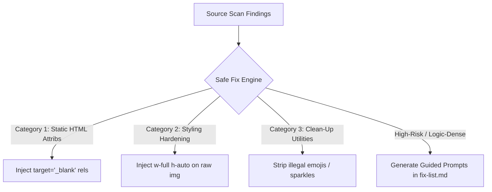

# Real Autopilot Source Repair Audit

**Author**: Antigravity AI  
**Date**: June 30, 2026  
**Status**: COMPLETE  
**Package**: `unslop-preflight` (v1.11.3)

---

## 1. Executive Summary

This audit evaluates the current state of **Autopilot Source Repair** in `unslop-preflight`. It outlines how the Autopilot pipeline behaves today, analyzes the boundaries between what can be automatically fixed versus what requires manual developer intervention, and designs a blueprint for extending safe code repairs. 

Our goal is to establish absolute clarity on existing implementation mechanisms, identify the risks of automatic source modification, and propose highly specific, deterministic safe-fix categories that align with modern web standards and clean-code guidelines.

---

## 2. Current Autopilot Behavior

The Autopilot CLI command (`npx unslop-preflight autopilot`) acts as an orchestration pipeline that executes iterative preflight verification, scoring, and non-destructive documentation repairs.

### 2.1 The Multi-Pass Loop
The core pipeline resides in [autopilotPlan.js](file:///Users/mamdouhaboammar/Documents/antigravity/zealous-galileo/unslop-preflight/src/core/autopilotPlan.js) under the `runAutopilotPipeline()` function. 

1. **Iteration Cap**: It supports iterative execution controlled by the `--max-passes=N` flag (defaulting to `1`, up to a maximum cap of `10`).
2. **Analysis Sequence**: Each pass executes `runSinglePass()`, which performs:
   - **Project Fingerprinting**: Infers project environment, structure, and package dependencies.
   - **Documentation Audit**: Scans existing spec files (`PRODUCT.md`, `DESIGN.md`, `AGENTS.md`).
   - **Source Code Scan**: Runs source-level scanners (`ui`, `accessibility`, `modular`) across key source directories.
   - **Evidence Compilation**: Merges findings into an array of unified `Evidence` objects.
   - **Initial Scoring**: Evaluates codebase readiness.
   - **Repair Execution**: Appends missing documentation/instruction blocks safely.
   - **Post-Repair Re-evaluation**: Re-runs documentation audits to compute the final pass score.
3. **Pass Tracking**: The pipeline saves the execution history of each pass under the `passes` array within the returned object.

### 2.2 Early Termination Triggers
To prevent infinite looping and unnecessary file operations, the pipeline terminates early based on specific `stopReason` checks:
- `'agent-ready'`: The project has reached the highest readiness tier (no blockages or crucial missing documentation).
- `'no-safe-repairs'`: No more documented Markdown repairs or safe configurations are available to apply.
- `'no-score-improvement'`: The post-repair scoring is less than or equal to the pre-repair scoring (meaning documentation edits did not improve readiness).
- `'max-passes'`: The loop reached the user-specified or hard-capped pass limit.
- `'error'`: In strict mode (`--strict`), a scanner failure terminates the pipeline with an error state.

---

## 3. What is Repaired Today vs. Only Reported

A core principle of `unslop-preflight` is **non-destructive, predictable execution**. This manifests in a strict boundary between automated file writing and user-notified warnings.

### 3.1 Documentation Repairs (Today: Auto-Repaired)
Autopilot is fully capable of auto-fixing missing documentation assets. If `PRODUCT.md`, `DESIGN.md`, or `AGENTS.md` are absent, they are generated using clean, production-ready templates. If they exist but miss crucial guidelines, specific instruction sections are safely appended.

These sections are delimited by explicit HTML comments (`<!-- unslop:start <rule-id> -->` and `<!-- unslop:end <rule-id> -->`) to maintain idempotency. They cover:
- **Product Scope**: Missing target users, acceptance criteria, and non-goals.
- **Design Specifications**: Responsive layout defaults (mobile and tablet viewports), interaction/loading states, form behavior, keyboard navigation focus management, WCAG contrast mathematics, and mobile-safe viewport instructions.
- **Anti-AI-Slop Rules**: Outlawing "sparkle" or "brain" icons and UI emojis.
- **Agent Handoff**: Strict do-not-break rules, verification checklists, and inspect-before-code requirements.

### 3.2 Code Repairs (Today: Only Reported)
While a user can request source fixes using `--apply-code-fixes`, **no automated source code modification is currently executed**.

When code fixes are requested, Autopilot safely captures this request but marks it as not implemented, returning a structured summary to prevent false expectations:

```json
{
  "codeFixes": {
    "requested": true,
    "applied": false,
    "reason": "not-implemented"
  }
}
```

Instead of altering source code directly, Autopilot warns the user and writes detailed manual repair guidelines to `.unslop/fix-list.md` and `.unslop/report.md`.

---

## 4. Unified Data Shapes

A key architectural asset of `unslop-preflight` is the strict structuring of data. Below are the precise shapes of findings and repair actions as implemented.

### 4.1 Source Scanner Finding Shape
When source-level scanners inspect folders like `src/`, `app/`, or `components/`, they output a list of individual findings. Each finding conforms to this JavaScript object shape:

```typescript
interface SourceScannerFinding {
  rule: string;       // Unique rule ID (e.g. 'unstable-random-key')
  file: string;       // Absolute file path to the matched source file
  line: number;       // 1-indexed line number where the pattern matched
  level: string;      // Severity level: 'blocker' | 'warning' | 'info'
  excerpt: string;    // The matched line snippet or rule fallback message
  type: string;       // Scanner category (e.g. 'ui', 'a11y', 'modular')
}
```

These findings are converted to rich `Evidence` instances inside the pipeline:

```javascript
new Evidence({
  ruleName: finding.rule,
  symptom: finding.excerpt,
  likelyRootCause: 'Code implementation error or omission',
  evidenceSnippet: finding.excerpt,
  file: finding.file,
  line: finding.line,
  fixStrategy: 'Fix the flagged source-level pattern, then rerun...',
  confidence: 'high',
  impact: finding.level === 'blocker' ? 'accessibility break' : 'visual break',
  severity: finding.level === 'blocker' ? 'error' : finding.level || 'warning',
  effort: 'small',
  type: finding.type || 'code'
});
```

### 4.2 Repair Action Shape
When the pipeline executes repairs, it records every automated file change. The output of [repair.js](file:///Users/mamdouhaboammar/Documents/antigravity/zealous-galileo/unslop-preflight/src/core/repair.js)'s `applyRepairs()` uses this schema:

```typescript
interface RepairAction {
  file: string;       // Absolute or relative path of the modified file
  rule?: string;      // The rule ID that triggered the repair (if applicable)
  action: string;     // Short description (e.g., 'created template', 'appended safe section')
}

interface ApplyRepairsResult {
  generated: string[];        // Array of newly created files
  changed: string[];          // Array of modified files
  repairs: RepairAction[];    // Descriptive repair records
  codeFixes: {
    requested: boolean;
    applied: boolean;
    reason: string;
  };
}
```

---

## 5. Findings Breakdown: Auto-Fixable vs. Manual Only

A rigorous classification must divide source findings into those that are safe for automatic fixing and those that must remain manual to prevent breaking application runtime logic.

### 5.1 Safely Auto-Fixable
Findings are safely auto-fixable if they have a **single, deterministic, and context-free solution** that does not alter business logic or styling architectures.

| Finding Rule Name | Diagnostic / Match | Proposed Automated Safe Fix |
| :--- | :--- | :--- |
| `target-blank-without-rel` | `<a>` tag with `target="_blank"` missing `rel="noopener noreferrer"` | Add or merge `rel="noopener noreferrer"` attributes on the JSX/HTML tag. |
| `input-without-autocomplete-review` | `<input>` with email/password type lacking an autocomplete value | Inject `autoComplete="email"` or `autoComplete="current-password"` contextually. |
| `no-emojis` | Static text containing raw emojis in visual files | Replace matching emojis with semantic, lightweight vector icon components or remove them. |
| `image-without-size-review` | `` lacking width, height, or aspect ratios | Inject fluid CSS-utility classes like `w-full h-auto` to establish layout boundaries. |

### 5.2 Manual Only
Findings must remain **manual only** if resolving them requires deep knowledge of state management, API behaviors, visual style choices, or UX specifications.

| Finding Rule Name | Reason Automatic Fixing is Blocked |
| :--- | :--- |
| `unstable-random-key` | Needs a stable entity identifier (like `user.id`); an AI cannot guess the correct data field. |
| `collection-map-empty-state-review` | Requires custom React/Vue empty-state components, illustration choices, or custom user copy. |
| `async-view-state-review` | Requires building loading skeletons, error boundaries, and hook integration. |
| `hardcoded-color-token-drift` | Requires visual mapping to the project's Tailwind config or design token definitions. |
| `motion-without-reduced-motion-review` | Requires importing custom animation hooks and conditional component logic. |

---

## 6. Detectable Project Checks

To inform repair scripts and prevent cross-framework errors, `unslop-preflight` utilizes a fingerprinting system in [projectFingerprint.js](file:///Users/mamdouhaboammar/Documents/antigravity/zealous-galileo/unslop-preflight/src/core/projectFingerprint.js) that detects the following parameters:

1. **Framework Core**: Parses dependencies to identify `next`, `react`, `vue`, `svelte`, `astro`, `nuxt`, or `unknown`.
2. **Language and Styling**: Infers if `hasTypescript` and `hasTailwind` are true based on dependencies and configuration directories.
3. **UI and Motion Libraries**: Scans for specific UI systems (`@mui/material`, `@chakra-ui/react`, `antd`, `radix-ui`, `shadcn`) and animation packages (`framer-motion`, `lucide-react`).
4. **Routing & Folder Layout**: Detects project architectures such as standard Next.js App Router (`app/`, `src/app/`) or Pages Router (`pages/`, `src/pages/`).
5. **Configuration Ecosystem**: Verifies the presence of crucial configuration targets like `tailwind.config.js`, `tsconfig.json`, `vite.config.js`, or `next.config.js`.

---

## 7. Risks of Source Modification

Executing automated changes on source code files in a CLI context introduces multiple distinct risk vectors that must be actively mitigated:

> [!WARNING]
> **Static Parsing Blind Spots**
> Source code scanners rely on Regex and basic pattern heuristics. Without a full AST (Abstract Syntax Tree) compiler, they do not understand syntax boundaries, leading to potential formatting corruption during replacement passes.

- **AST Formatting Corruption**: Simple string replacements can easily break multiline JavaScript templates, nested JSX, or CSS structures, resulting in compiler syntax errors.
- **Accidental State / Rerender Floods**: Attempting to resolve unstable keys or layout structures automatically can alter variable scopes or trigger infinite rendering loops.
- **Breaking Visual Intention**: Forcing structural layout modifications (like overwriting broad `transition-all` definitions) might corrupt intentional, complex transitions built by designers.
- **Git Drift & Merge Conflicts**: Running aggressive modification sweeps during CI/CD can introduce invisible code changes, creating conflicts with active developer branches.

---

## 8. Proposed Safe-Fix Categories (The Path Forward)

To introduce safe automated code fixes without compromising stability, we propose establishing three restricted safe-fix categories in future iterations:



### 8.1 Category 1: Static HTML & JSX Attribute Injection
- **Scope**: Injecting required browser-level safety attributes.
- **Example**: Appending `rel="noopener noreferrer"` to `target="_blank"` anchors, or adding `autoComplete` attributes on typical sign-up/login form fields.
- **Implementation**: Parse the code lines, target the element, and insert attributes via clean, isolated inline injections.

### 8.2 Category 2: Styling Hardening and Layout Shields
- **Scope**: Non-destructive CSS or CSS-utility class expansion to enforce visual safety.
- **Example**: Injecting safety height/width limits (such as adding `w-full h-auto` on simple JSX elements lacking sizes) to protect visual stability without breaking existing layout models.

### 8.3 Category 3: Asset Clean-Up Utilities
- **Scope**: Removing or replacing forbidden emojis and illegal visual slop tags.
- **Example**: Finding standard emojis embedded inside buttons/text containers and stripping them, or substituting sparkle assets with semantic icon primitives (e.g. replacing `<SparkleIcon />` with standard `<StarIcon />`).

### 8.4 High-Risk Findings: Guided Refactoring Prompts
For findings that involve state or network logic (like missing empty states or async views), `unslop-preflight` should never execute silent source changes. Instead, it will generate highly descriptive prompt scripts inside `.unslop/fix-list.md` tailored specifically for AI coding assistants (like Claude, Gemini, or Cursor) to execute safely with human review.
